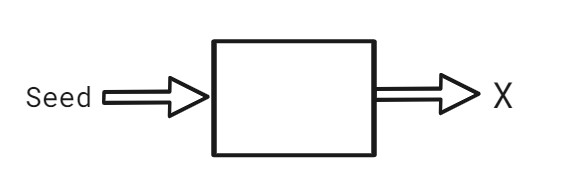
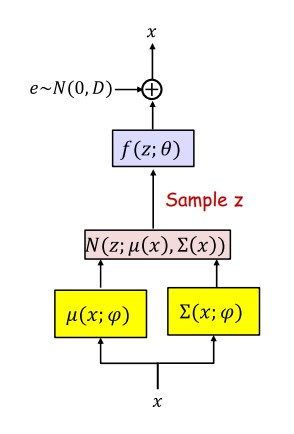

<h1 align="center"> Varitional Autoencoder</h1>

First let's define the generative model. The generative A model for the probability distribution of a data $X$ (e.g. Multinomial, Gaussian, ..etc). Computational equivalent: a model that can be used to **generate** data with a distribution similar to the given data $X.$
</img> <h4 align="center">It takes in random seeds and outputs random samples like $X.$ </h4>

**Varitional Autoencoder** is a directed generative model. It has both observed and latent variables and gives us a latent space to sample from.

**VAE consists of :** 
**1- The Decoder:** is a non-linear gaussian model (NLGM) and is the actual generative model. 
**2- The Encoder:** is a module that generates the samples of $Z$ (latent space) needed to complete the data, in order to estimate the parameters of the NLGM (Decoder), also can be used to generate the approximated distribution of the latent space representations conditional on specific inputs (Much similar to the Autoencoder).

**Learning a generative model for data:**
- Given set of observation $X$ = { $x$ }
- Choose a model $P(X|θ)$ for the distribution of $X$
- Estimate $θ$ such that $P(X|θ)$ best fit to data (Results in maximum log likelihood estimation)

To get a sample same as our data, we must learn the distribution of the data, then sample from it.
</img>

- **$Z$** is the latent space representation of the data.
- **$μ(x; φ)$** can be also used as an expected latent representation of **$X$**.
- **$f(z; θ)$** is generally modulled by neural network.
- **$μ(x; φ)$** & **$∑(x; φ)$** are moduled by a common network with two output.
 

<h6 align="center"> <a href="https://cedar.buffalo.edu/~srihari/CSE676/21.3-VAE-Apps.pdf" align="center">Source</a> </h6>
